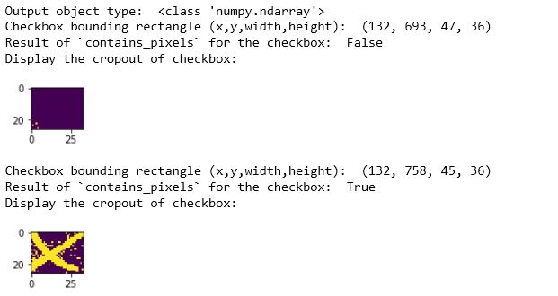

[](https://github.com/karolzak/boxdetect/actions?query=workflow%3A%22CI+Build%22)
[](https://pypi.org/project/boxdetect/) 
[](https://pypi.org/project/boxdetect/)
[](https://pypi.org/project/boxdetect/)
[](https://github.com/karolzak/boxdetect/blob/master/LICENSE)

**Share:**  
[](http://twitter.com/share?text=Check%20out%20BoxDetect%20Python%20package%20which%20helps%20you%20extract%20rectangular%20boxes%20from%20images&url=https://github.com/karolzak/boxdetect/&hashtags=python,computervision,boxesdetection,shapesdetection,opencv)
<!-- [](http://www.linkedin.com/shareArticle?mini=true&url=https://github.com/karolzak/boxdetect&title=Boxdetect%20python%20package) -->


**BoxDetect** is a Python package based on OpenCV which allows you to easily detect rectangular shapes like character or checkbox boxes on scanned forms.

Main purpose of this library is to provide helpful functions for processing document images like bank forms, applications, etc. and extract regions where character boxes or tick/check boxes are present.


## Getting Started

Checkout the [examples below](#Usage-examples) and 
[get-started-pipelines.ipynb](https://github.com/karolzak/boxdetect/blob/master/notebooks/get-started-pipelines.ipynb) notebook which holds end to end examples for using **BoxDetect** with premade `boxdetect.pipelines` functions.

## Installation

**BoxDetect** can be installed directly from this repo using `pip`:

```
pip install git+https://github.com/karolzak/boxdetect
```

or through [PyPI](https://pypi.org/project/boxdetect/)

```
pip install boxdetect
```

# Usage examples

You can use `BoxDetect` either by leveraging one of the pre-made pipelines or by treating `BoxDetect` functions as your toolbox to compose your own pipelines that fits your needs perfectly.

- [Using pre-made pipelines](#Using-`boxdetect.pipelines`)  
    - [Detecting boxes and grouping them together with boxdetect.pipelines.get_boxes](#Detect-character-boxes-and-group-them-together)  
    - [Changing `group_size_range` param to highlight checkboxes](#Highlighting-just-the-checkboxes)  
    - [Using `boxdetect.pipelines.get_checkboxes` to retrieve checkboxes and their values](#Using-`boxdetect.pipelines.get_checkboxes`-to-retrieve-and-recognize-just-the-checkboxes)  


## Using `boxdetect.pipelines`

### Detect character boxes and group them together

Start with getting the default `PipelinesConfig` and adjusting it for your requirements and data:
```python
from boxdetect import config

file_name = 'form_example1.png'

cfg = config.PipelinesConfig()

# important to adjust these values to match the size of boxes on your image
cfg.width_range = (30,55)
cfg.height_range = (25,40)

# the more scaling factors the more accurate the results but also it takes more time to processing
# too small scaling factor may cause false positives
# too big scaling factor will take a lot of processing time
cfg.scaling_factors = [0.7]

# w/h ratio range for boxes/rectangles filtering
cfg.wh_ratio_range = (0.5, 1.7)

# group_size_range starting from 2 will skip all the groups
# with a single box detected inside (like checkboxes)
cfg.group_size_range = (2, 100)

# num of iterations when running dilation tranformation (to engance the image)
cfg.dilation_iterations = 0
```

As a second step simply run:
```python
from boxdetect.pipelines import get_boxes

rects, grouping_rects, image, output_image = get_boxes(
    file_name, cfg=cfg, plot=False)
```

Each of the returned elements in `grouping_rects` are rectangular bounding boxes representing grouped character boxes (x, y, w, h)
```python
print(grouping_rects)

OUT:
# (x, y, w, h)
[(276, 276, 1221, 33),
 (324, 466, 430, 33),
 (384, 884, 442, 33),
 (985, 952, 410, 32),
 (779, 1052, 156, 33),
 (253, 1256, 445, 33)]
```

Display output image with bounding rectangles drawn on it
```python
plt.figure(figsize=(20,20))
plt.imshow(output_image)
plt.show()
```


### Highlighting just the checkboxes

And if you would like to highlight only the checkboxes you just need to change a single parameter:
```python
# limit down the grouping algorithm to just singular boxes (e.g. checkboxes)
cfg.group_size_range = (1, 1)
```


### Using `boxdetect.pipelines.get_checkboxes` to retrieve and recognize just the checkboxes

Assuming we're using the same image and config is already adjusted ([look above](#Detect-character-boxes-and-group-them-together)) we just need to run:

```python
from boxdetect.pipelines import get_checkboxes

checkboxes = get_checkboxes(
    file_path, cfg=cfg, px_threshold=0.1, plot=False, verbose=True)
```
If `verbose=True` it will print out bunch of details of checkboxes being detected and estimation being made about their state:
```
Processing file:  ../images/form_example1.png
----------------------------------
nonzero_px_count:  3
all_px_count:  858
nonzero_px_count / all_px_count =  0.0034965034965034965
----------------------------------
----------------------------------
nonzero_px_count:  363
all_px_count:  858
nonzero_px_count / all_px_count =  0.4230769230769231
----------------------------------
```

Now looking into the details of our results:
```python
print("Output object type: ", type(checkboxes))
for checkbox in checkboxes:
    print("Checkbox bounding rectangle (x,y,width,height): ", checkbox[0])
    print("Result of `contains_pixels` for the checkbox: ", checkbox[1])
    print("Display the cropout of checkbox:")
    plt.figure(figsize=(1,1))
    plt.imshow(checkbox[2])
    plt.show()
```
We should see the following:


